

# PLOGUES

**지역 기반 환경 활동의 모집부터 참여, 인증, 후기까지 연결하는 커뮤니티 플랫폼**

플로깅과 식목 활동을 함께할 사용자를 모집하고,  
참여 요청 · 승인 · 대화 · 활동 인증 · 후기 공유까지 하나의 흐름으로 제공합니다.

 

 

**2026.06.17 - 2026.07.15 · 5인 팀 프로젝트**

[프로젝트 개요](#1-프로젝트-개요) · [핵심 흐름](#2-핵심-사용자-흐름) · [아키텍처](#4-시스템-아키텍처) 

---

## 1. 프로젝트 개요

### 1.1 기획 배경

환경 보호에 관심이 있어도 혼자 꾸준히 실천하기는 어렵고, 지역과 일정이 맞는 사람을 찾거나 활동 결과를 기록할 공간도 제한적입니다.

PLOGUES는 이러한 불편을 해결하기 위해 **환경 활동의 모집부터 활동 이후의 인증과 후기까지 연결된 커뮤니티**를 목표로 개발했습니다.

<table>
  <thead>
    <tr><th>기존 불편</th><th>PLOGUES의 접근</th><th>기대 효과</th></tr>
  </thead>
  <tbody>
    <tr><td>함께 활동할 사람을 찾기 어려움</td><td>지역 · 일정 · 모집 인원 기반 모집글</td><td>오프라인 환경 활동의 접근성 향상</td></tr>
    <tr><td>신청과 참여자 관리가 분리됨</td><td>참여 요청과 승인 · 거절 상태 관리</td><td>모집장과 참여자가 동일한 상태를 공유</td></tr>
    <tr><td>활동 이후 기록이 남지 않음</td><td>사진과 활동량을 포함한 인증 · 후기</td><td>실천 결과를 축적하고 참여 동기 제공</td></tr>
  </tbody>
</table>

### 1.2 주요 사용자

<table>
  <thead>
    <tr><th>사용자</th><th>주요 목적</th></tr>
  </thead>
  <tbody>
    <tr><td><b>참여자</b></td><td>주변의 플로깅 · 식목 모임을 찾고 참여 신청, 대화, 후기 작성</td></tr>
    <tr><td><b>모집장</b></td><td>모임 생성, 참여 요청 승인 · 거절, 참여자 관리, 활동 인증</td></tr>
    <tr><td><b>관리자</b></td><td>공지 · 이벤트 작성, 문의 답변, 신고 내용 확인 및 처리</td></tr>
  </tbody>
</table>

### 1.3 서비스 소개

PLOGUES는 단순한 게시판 모음이 아니라 다음 활동이 순차적으로 이어지도록 설계한 서비스입니다.

> **모집글 작성 → 참여 요청 → 승인/거절 → 참여자 대화 → 활동 인증 → 후기 공유**

회원과 관리자의 권한을 구분하고 JWT 기반 인증을 적용했으며, React SPA와 Spring Boot REST API를 분리하여 프론트엔드와 백엔드를 독립적으로 개발했습니다.

---

## 2. 핵심 사용자 흐름

    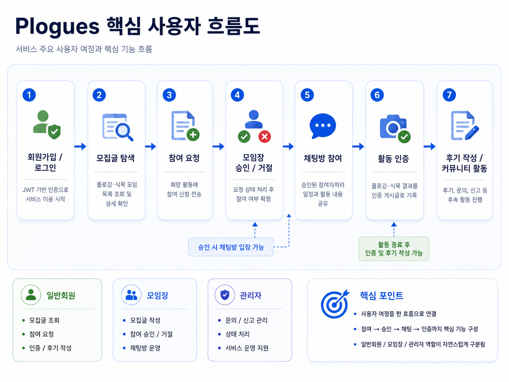

참여 요청의 상태는 `WAITING`, `ACCEPTED`, `DENIED`로 관리하며, 승인된 사용자만 해당 활동의 대화 흐름에 참여할 수 있도록 구성했습니다.

---

## 3. 주요 기능

<table>
  <thead>
    <tr><th>기능 영역</th><th>주요 기능</th></tr>
  </thead>
  <tbody>
    <tr><td>회원 · 인증</td><td>회원가입, 로그인, Access Token 갱신, 역할 기반 접근 제어</td></tr>
    <tr><td>모집 게시판</td><td>플로깅 · 식목 모집글 CRUD, 지역 검색, 일정 · 정원 관리</td></tr>
    <tr><td>참여 요청</td><td>참여 신청, 모집장의 수락 · 거절, 최대 인원 검증</td></tr>
    <tr><td>활동 인증</td><td>활동 사진과 수거 무게 · 식목 수량 등록, 인증글 관리</td></tr>
    <tr><td>후기 · 공지</td><td>후기 CRUD, 댓글, 신고 연동, 공지 · 이벤트 통합 관리</td></tr>
    <tr><td>문의 · 신고</td><td>사용자 문의와 관리자 답변, 처리 상태 관리, 공통 신고</td></tr>
  </tbody>
</table>

---

## 4. 시스템 아키텍처

    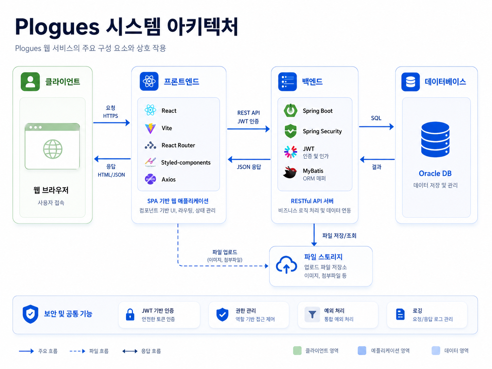

### 구조 설계 원칙

- **Controller - Service - Mapper** 계층을 분리하여 요청 처리, 비즈니스 규칙, 데이터 접근의 책임을 구분했습니다.
- 백엔드 패키지와 프론트 화면을 기능 도메인별로 나누어 팀원이 동시에 개발할 수 있도록 구성했습니다.
- 서버에서 인증과 작성자 · 관리자 권한을 최종 검증하여 UI 조작이나 API 직접 호출을 통한 우회를 방지했습니다.
- 목록 응답에는 공통 `PageInfo`와 제네릭 응답 구조를 적용해 페이지 정보와 실제 목록을 함께 반환했습니다.
- 파일은 실제 저장 파일과 DB의 파일 메타데이터를 분리하여 다중 파일 조회와 변경을 관리했습니다.

---

## 🛠 기술 스택

| 구분 | 기술 스택 | 활용 내용 |
| :--- | :--- | :--- |
| **Backend** | Java **21**, Spring Boot **3.5.16**, Spring Web, Spring Validation | REST API 개발, 계층형 아키텍처(Controller-Service-Mapper), 비즈니스 로직 처리 및 입력값 검증 |
| **Security** | Spring Security, JWT **0.12.3** | Access Token·Refresh Token 기반 인증 및 인가, 역할(Role) 검증, JWT 인증 필터 처리 |
| **Persistence** | MyBatis Spring Boot Starter **3.0.5**, JDBC | SQL Mapper 기반 데이터 접근, 동적 SQL, 페이징 및 트랜잭션 처리 |
| **Database** | Oracle Database **21c XE** | 관계형 데이터 저장, JOIN, 시퀀스, 제약조건 및 게시판·회원·참여·문의·신고 데이터 관리 |
| **Frontend** | React **19.2.7**, Vite **8**, JavaScript (ES6+) | SPA 개발, 컴포넌트 기반 UI 구성 및 사용자 인터페이스 구현 |
| **State Management** | React Context API, React Hooks | 로그인 사용자 정보와 전역 상태 관리, 컴포넌트별 상태 관리 |
| **Routing · HTTP** | React Router DOM **7.18.0**, Axios **1.18.1** | SPA 라우팅, REST API 통신, JWT 재발급 및 실패 요청 자동 재요청 처리 |
| **UI / UX** | styled-components **6.4.3**, SweetAlert2 **11.26.25**, react-icons **5.7.0** | CSS-in-JS 스타일링, 공통 알림·확인 모달 및 아이콘 컴포넌트 구현 |
| **File Handling** | Multipart/Form-Data | 이미지 업로드, 첨부파일 저장, 수정·삭제 및 파일 메타데이터 관리 |
| **Visualization** | Recharts **3.9.2** | 온도·습도·토양 수분 센서 데이터 시각화 |
| **Build Tool** | Gradle **8.14.5** | 백엔드 프로젝트 빌드 및 의존성 관리 |
| **Development Tools** | Spring Tool Suite **5.2.0**, VS Code, DBeaver | 백엔드·프론트엔드 개발 및 Oracle 데이터베이스 관리 |
| **Collaboration** | Git, GitHub, Postman | 브랜치 기반 형상 관리, Pull Request 협업 및 REST API 테스트 |

---

## 6. 개발 기간 및 팀 구성

- **인원:** 5명
- **방식:** 프론트엔드 · 백엔드 저장소 분리, 기능별 브랜치와 Pull Request 기반 협업

| 팀원 | 주요 담당 | GitHub |
| :--- | :--- | :--- |
| **남지호** | 후기 게시판, 공지 · 이벤트 CRUD, 파일 · 댓글 · 신고 연동 및 관련 화면 | https://github.com/jiho0828 |
| **신순주** | 모집 게시판 수정 · 삭제, 참여 승인 이후 대화 작성 흐름과 기능 연동 | https://github.com/grape-fruit-apricot |
| **이다산** | 참여 신청과 승인 · 거절, 마이페이지 참여 · 모집 목록, 관련 프론트 · 백엔드 | https://github.com/ham-zi |
| **이승현** | 인증 게시판 CRUD, 이미지 제약 처리, 신고 게시판 연계 |  https://github.com/rlaehqkf |
| **정주미** | 문의 게시판 백엔드와 답변 · 상태 관리, 로그인 · 회원가입과 인증 흐름 |  https://github.com/peony639-lab |

<!-- 팀원 GitHub 또는 이메일을 공개할 경우 위 표에 링크 열을 추가합니다. -->

---

## 7. 역할별 MVP 시나리오

| 참여자 | 모집장 |
| :---: | :---: |
| 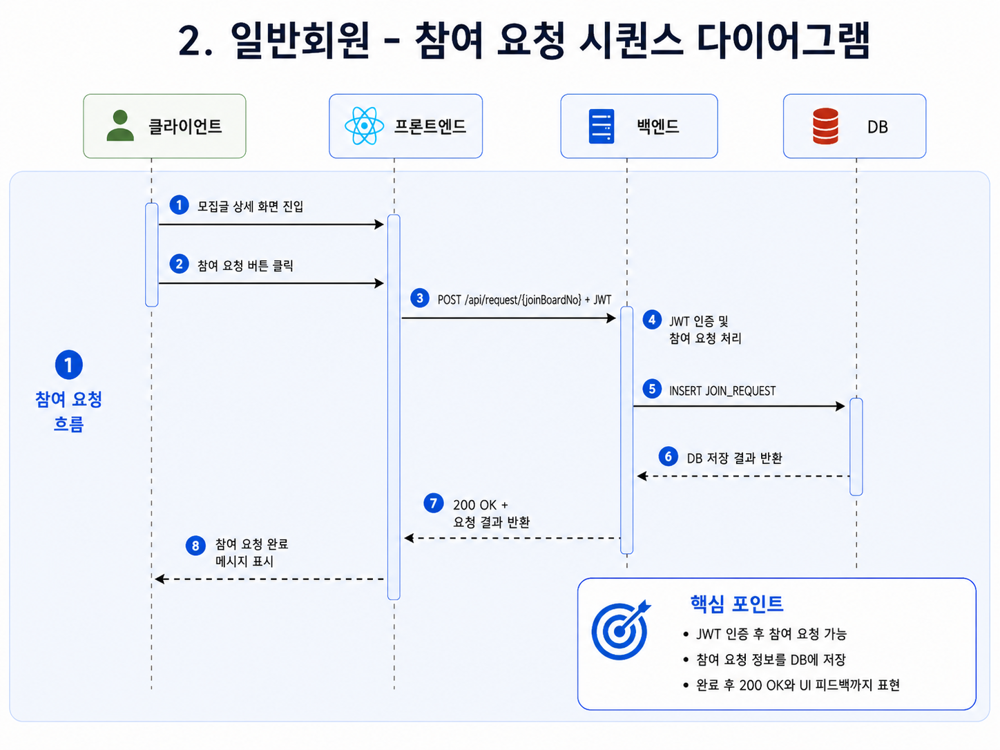 | 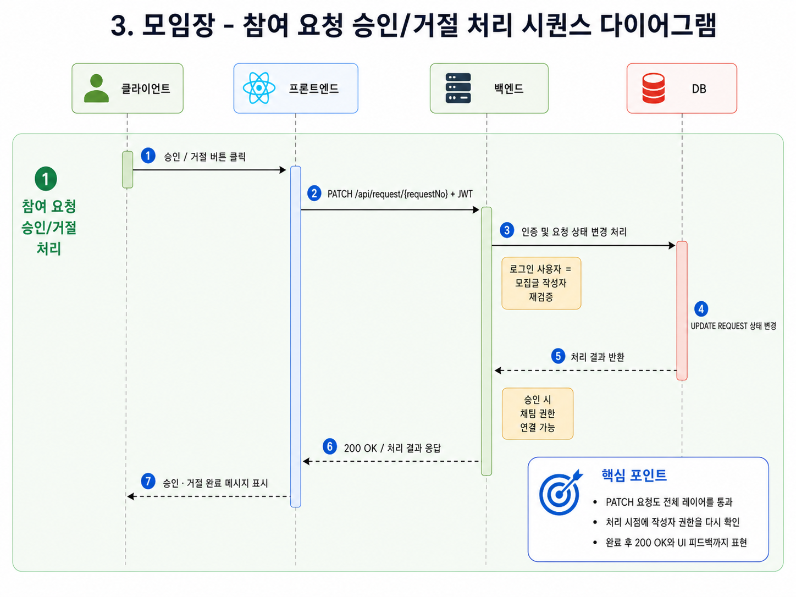 |
| 모집 검색 → 신청 → 상태 확인 → 대화 → 후기 | 모집 작성 → 요청 관리 → 참여자 대화 → 활동 인증 |

| 관리자 | 비회원 |
| :---: | :---: |
| 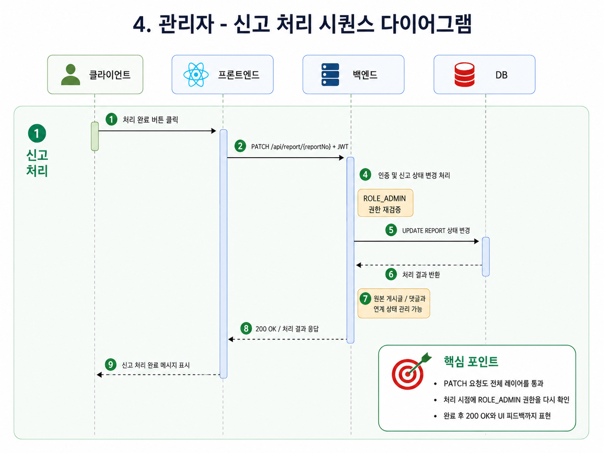 | 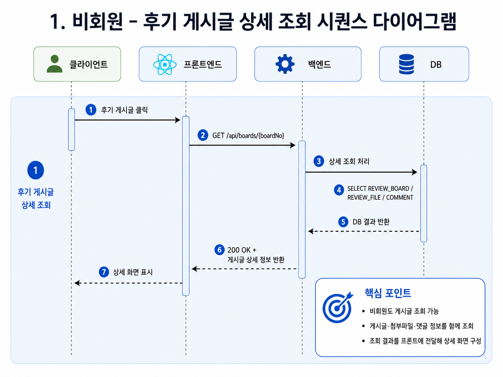 |
| 게시글  | 로그인 → 토큰 검증 → 재발급 → 역할별 접근 제어 |

<!-- 이미지가 준비되기 전에는 위 경로에 파일이 없어 빈 이미지로 표시될 수 있습니다. -->

---

## 8. 개발 산출물 및 협업 결과

| 산출물 | 결과 |
| :--- | ---: |
| Figma 설계 화면 | **36개** |
| 실제 구현 화면 | **24개** |
| REST API | **52개** |
| 데이터베이스 테이블 | **20개** |
| 테스트 케이스 | **173개** |
| Pull Request | **204개** - Backend 117 / Frontend 87 |
| 프로젝트 카드 | **92개** - Backend 57 / Frontend 35 |

### 협업 방식

- 기능별 `feature` 브랜치를 생성하고 작업 완료 후 Pull Request로 병합했습니다.
- Postman으로 API의 정상 · 실패 · 인증 · 권한 케이스를 검증한 뒤 React 화면을 연결했습니다.
- API 요청 · 응답 규격과 DTO 구조를 공유하여 프론트엔드와 백엔드의 데이터 형식을 통일했습니다.
- 파일, 페이지 정보, 공통 응답, 알림, JWT 처리 등 반복 요소를 공용 모듈로 관리했습니다.
- 코드 리뷰와 회의 기록을 통해 진행 상황, 충돌 가능성, 다음 작업을 지속적으로 공유했습니다.

---

## 9. 데이터베이스 설계

회원, 게시판, 댓글, 파일, 참여 요청, 문의, 신고, 대화, 환경 데이터 등 도메인별로 테이블을 분리하고 외래키를 통해 관계를 구성했습니다.

- **테이블:** 20개
- **ERD:** [ERDCloud에서 보기](https://www.erdcloud.com/d/yAY7hJfpooMb4siPx)
- 게시글과 댓글은 `DELETED` 또는 `STATUS`를 활용해 소프트 삭제했습니다.
- 파일 정보를 게시글과 분리하여 다중 파일과 변경 이력을 관리했습니다.
- 신고는 게시판 유형과 대상 PK를 함께 저장하여 여러 게시판을 공통 구조로 처리했습니다.
- 목록 조회에는 Oracle `OFFSET / FETCH` 기반 페이지네이션을 적용했습니다.

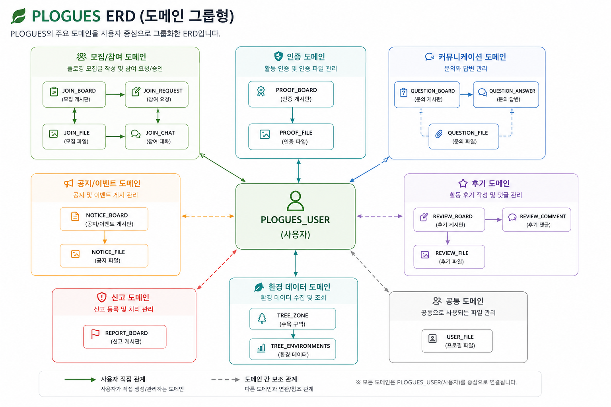

---

## 10. 주요 API

전체 52개 API 중 핵심 흐름을 구성하는 대표 API입니다.

| 영역 | Method | Endpoint | 설명 |
| :--- | :---: | :--- | :--- |
| 인증 | `POST` | `/api/auth/login` | 로그인 및 토큰 발급 |
| 인증 | `POST` | `/api/auth/refresh` | Access Token 갱신 |
| 회원 | `POST` | `/api/users` | 회원가입 |
| 후기 | `GET` | `/api/boards` | 후기 목록과 페이징 |
| 후기 | `POST` | `/api/boards` | 후기와 파일 등록 |
| 모집 | `GET` | `/api/joins` | 모집 목록 조회와 검색 |
| 모집 | `POST` | `/api/joins` | 모집글 작성 |
| 참여 | `POST` | `/api/request/{joinNo}` | 참여 신청 |
| 참여 | `PATCH` | `/api/request/accept` | 참여 요청 수락 |
| 참여 | `PATCH` | `/api/request/deny` | 참여 요청 거절 |
| 인증 | `GET/POST` | `/api/proof/**` | 활동 인증 조회 · 작성 |
| 공지 | `GET/POST` | `/api/notices/**` | 공지 · 이벤트 조회와 관리자 작성 |
| 문의 | `GET/POST` | `/api/question/**` | 문의 조회 · 작성 · 답변 |
| 신고 | `POST` | `/api/report` | 콘텐츠 신고 등록 |
| 대화 | `GET/POST` | `/api/chats/**` | 활동별 대화 조회 · 작성 |

---

## 11. 화면

실제 화면 캡처를 아래 경로에 추가하면 기능별 화면을 한눈에 확인할 수 있습니다.

| 메인 화면 | 모집 상세 | 참여 요청 관리 |
| :---: | :---: | :---: |
| 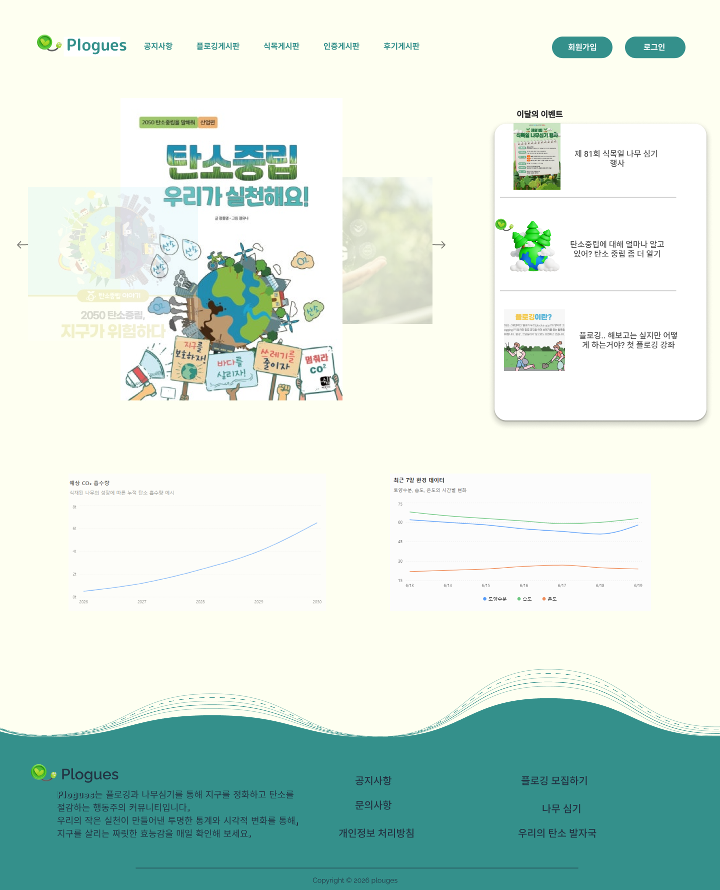 | 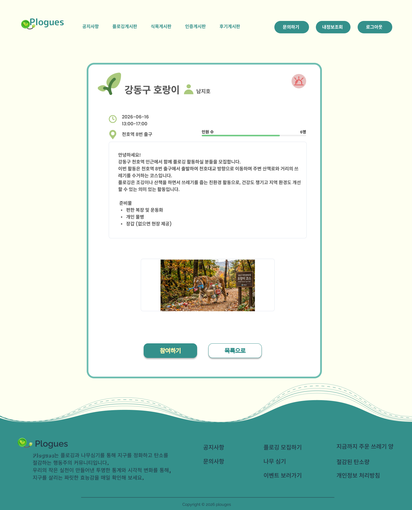 | 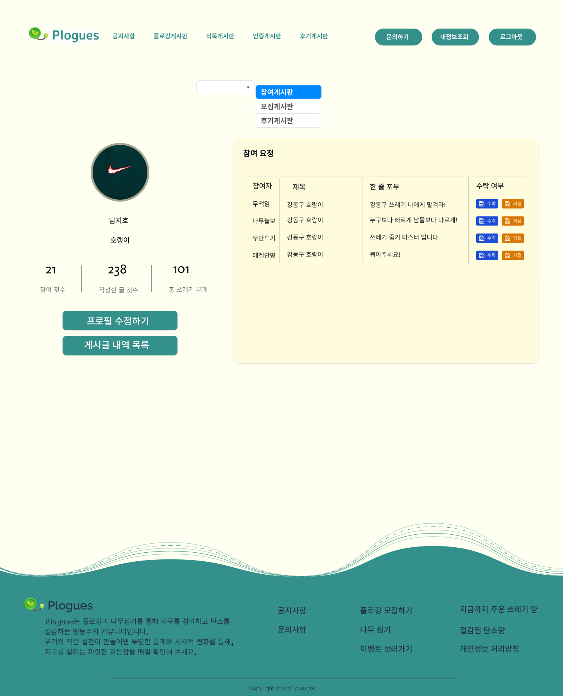 |

| 대화방 | 활동 인증 | 관리자 문의 · 신고 |
| :---: | :---: | :---: |
| 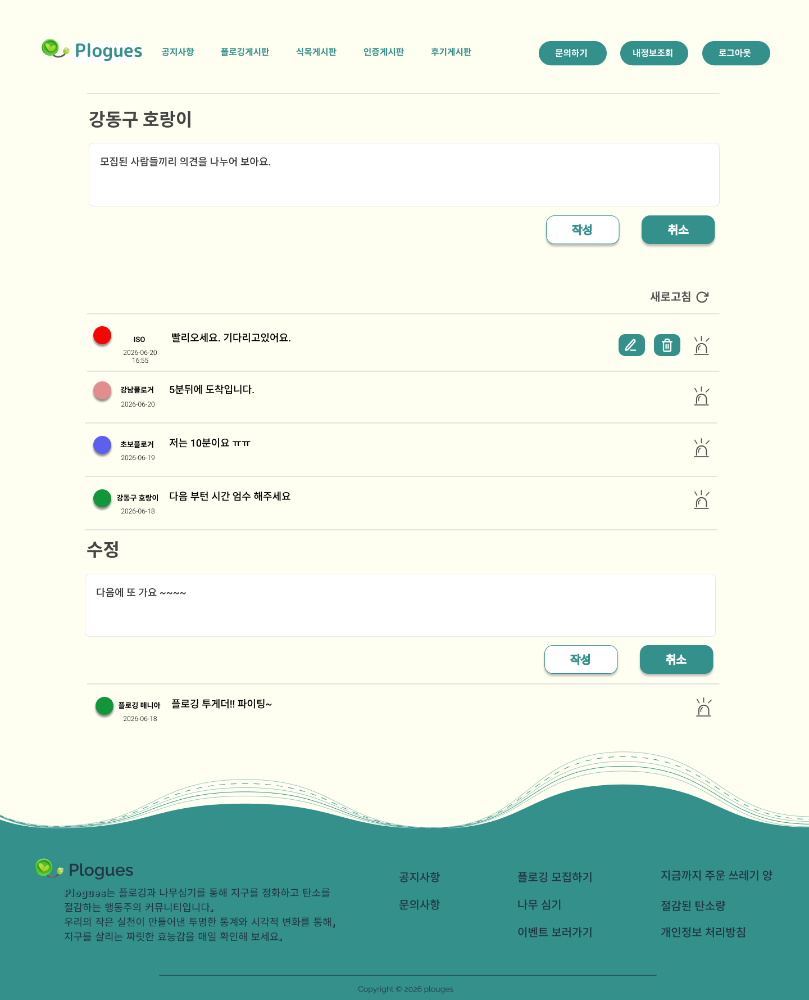 | 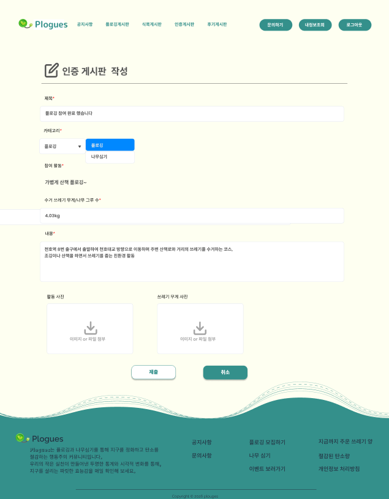 | 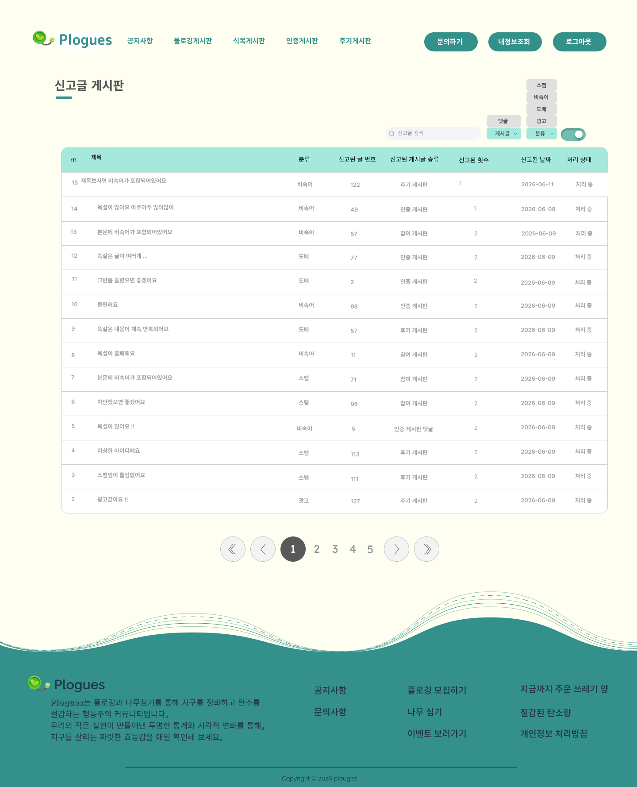 |

---

## 12. 테스트 및 품질 검증

| 영역 | 테스트 케이스 | 설명 |
| :--- | ---: | :--- |
| 회원 | **16건** | 회원가입, 로그인, 회원 정보 |
| 인증(JWT) | **13건** | 토큰 발급 및 재발급, 인증 |
| 모집게시판 | **19건** | 모집 CRUD 및 조회 |
| 참여요청 | **16건** | 신청, 승인, 거절 |
| 인증게시판 | **18건** | 활동 인증 CRUD |
| 후기게시판 | **18건** | 후기 CRUD 및 파일 |
| 후기댓글 | **8건** | 댓글 CRUD |
| 공지사항 | **12건** | 공지 CRUD |
| 문의게시판 | **16건** | 문의 CRUD |
| 문의답변 | **5건** | 답변 등록 및 수정 |
| 신고 | **13건** | 신고 등록 및 처리 |
| 모임대화 | **11건** | 채팅 조회 및 작성 |
| 환경센서 | **5건** | 센서 데이터 조회 |
| 탄소통계 | **3건** | 통계 데이터 조회 |
| 홈 | **1건** | 메인 화면 조회 |
| **합계** | **173건** | 전체 기능 테스트 완료 |

---

## 13. 프로젝트 결과

### 구현 결과

- 모집, 참여 요청, 승인, 대화, 인증, 후기까지 이어지는 핵심 사용자 흐름을 구현했습니다.
- JWT 인증 · 인가와 서버 권한 검증을 통해 일반 사용자와 관리자의 접근 범위를 구분했습니다.
- 게시판, 파일, 댓글, 문의, 신고, 마이페이지를 포함한 커뮤니티 구조를 구현했습니다.
- 공통 페이징, 응답, 알림, 파일 모듈을 적용하여 반복 코드를 줄이고 확장 가능한 구조를 구성했습니다.
- 정상 · 실패 · 권한 · 경계 상황을 포함한 173개 테스트 케이스로 주요 기능을 점검했습니다.

**PLOGUES - 함께하는 환경 활동을 하나의 흐름으로 연결합니다.**

KH 정보교육원 세미 프로젝트 · Team ISO

